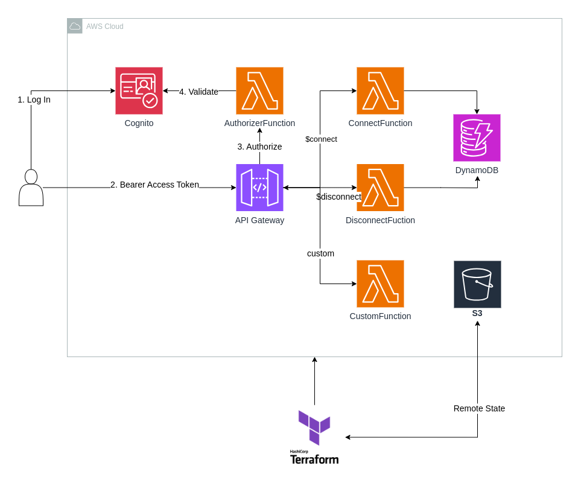

# AWS API Gateway with Cognito

This project configures an AWS WebSocket API Gateway with authentication provided by Amazon Cognito. It enables secure, authorized access to the WebSocket API for clients using Cognito as the identity provider.

### Overview

- **API Gateway**: A WebSocket API Gateway setup to handle real-time communication with clients.
- **Cognito**: Used to manage user authentication and authorization, ensuring that only authenticated users can connect to and interact with the WebSocket API.

### Features

- **Secure WebSocket API**: Leverages AWS API Gateway's WebSocket protocol for bidirectional communication.
- **User Authentication**: Uses Amazon Cognito to authenticate users and authorize access to the API.

### Setup and Deployment

1. Follow the steps outlined in the `./infra/README.md` to initialize and deploy the necessary infrastructure in the correct order.

2. Go to the Cognito Client Hosted UI, and log in as user `test@cognito.com`. It will redirect you to localhost:3000, copy the `id_token` parameter.

3. On your AWS Account, copy the `WebSocket URL` from the `Stages` tab.

4. Using an API tool (e.g. Postman, wscat) paste the URL and include in the header:
`Authorization: Bearer <id_token>`

5. Connect to the WebSocket API and send a message like this one:
```json
{
    "action": "custom",
    "name": "Ahmed"
}
```

### Architecture


---

This setup provides a scalable, secure API architecture suitable for applications requiring real-time interactions with authorized users.